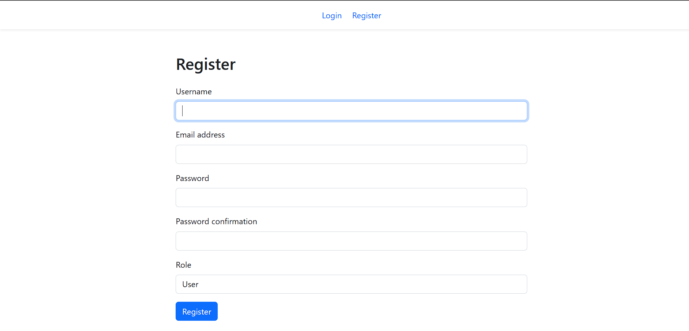
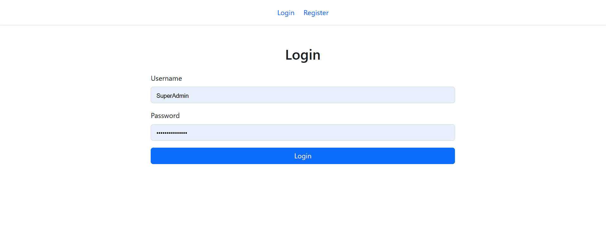
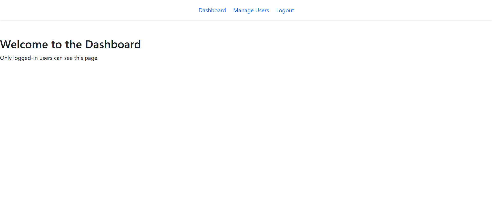
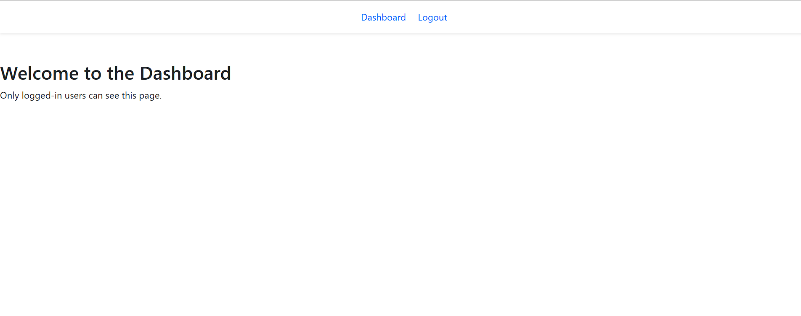

# Role-Based Authentication System in Django 5

## Project Overview
This project is a Django 5 web application that implements role-based authentication and access control. It includes registration, login, logout functionalities, and provides different access levels based on user roles (e.g., `admin`, `user`). Admin users have exclusive access to specific pages, such as user management, while regular users have restricted access.

## Features
- **User Registration and Login**: New users can register, and existing users can log in.
- **Role-Based Access Control**: Different roles (`admin`, `user`) have specific access permissions.
- **Dashboard**: A private dashboard accessible only to logged-in users.
- **User Management Page**: Accessible only to users with the `admin` role.
- **Redirection Logic**: Authenticated users are redirected to the dashboard when attempting to access the login or registration pages. Unauthenticated users are redirected to the login page when trying to access private pages.

## Project Preview
- **User Registration Page**:
  
- **User Login Page**:
  
- **Admin Dashboard Page**: Here you can see admin can see manage user page 
 
- **User Dashboard Page**: Here user can not see manage user tab and page  
  


markdown
Copy code

## Installation

### Prerequisites
- Python 3.10 or later
- Django 5.0
- Git

### Setup
1. **Clone the repository**:
   ```bash
   git clone https://github.com/yourusername/role-based-auth-django.git
   cd role-based-auth-django
Create a virtual environment:

bash
Copy code
python -m venv venv
source venv/bin/activate  # On Windows use `venv\Scripts\activate`
Install dependencies:

   ```bash
   ROOT_URLCONF = 'authwithrole.urls' add this line in setting below install app
   Apply migrations
   ```

bash
Copy code
python manage.py runserver
Usage
Navigate to http://127.0.0.1:8000/ to access the home page.
Register a new user or log in using the credentials of the created superuser.
The dashboard and user management pages will be accessible based on user roles.
Users trying to access restricted pages without appropriate roles will receive an "Access Denied" message.

Contributing
Pull requests are welcome. For significant changes, please open an issue first to discuss your ideas.

Contact
For any inquiries or support, please contact ganesh.golhar35@gmail.com.
